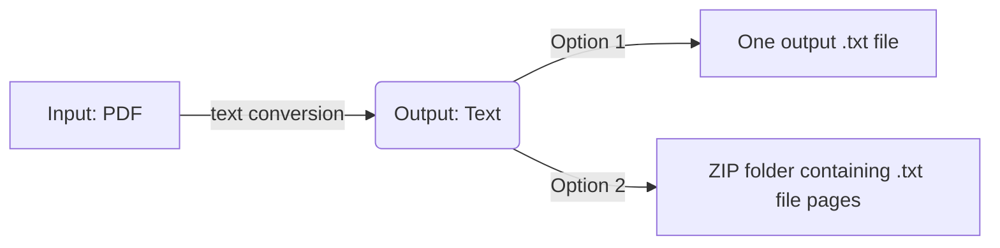

# Text data extractor: PDF to Text

This PDF text data extraction app takes a PDF document as input and return either a txt file that contains all pages or a compressed folder of txt files representing the document pages.

