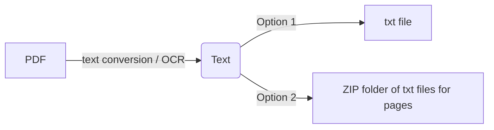

# PDF to Text

PDF text data extraction app that takes a PDF document as input and returns either a txt file that contains all pages or a compressed folder of txt files representing the document pages. OCR can also be enabled for scanned docoments.

## How does it worK?

1. Upload your PDF.
2. Enable OCR (for scanned documents).
3. Select the PDF language.
4. Download your output file (zip/txt).

## How to support the project
You can help support the project through feedback and/or [buy me coffee](https://www.buymeacoffee.com/nainiayoub).

